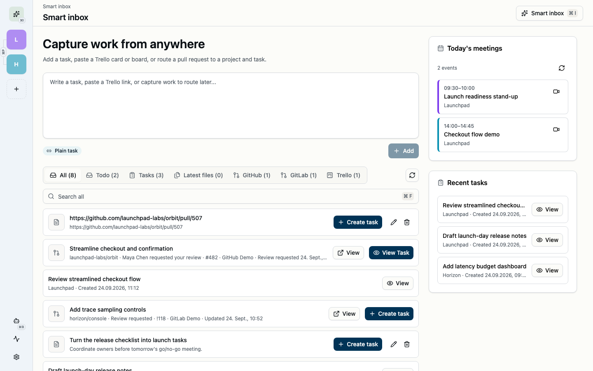
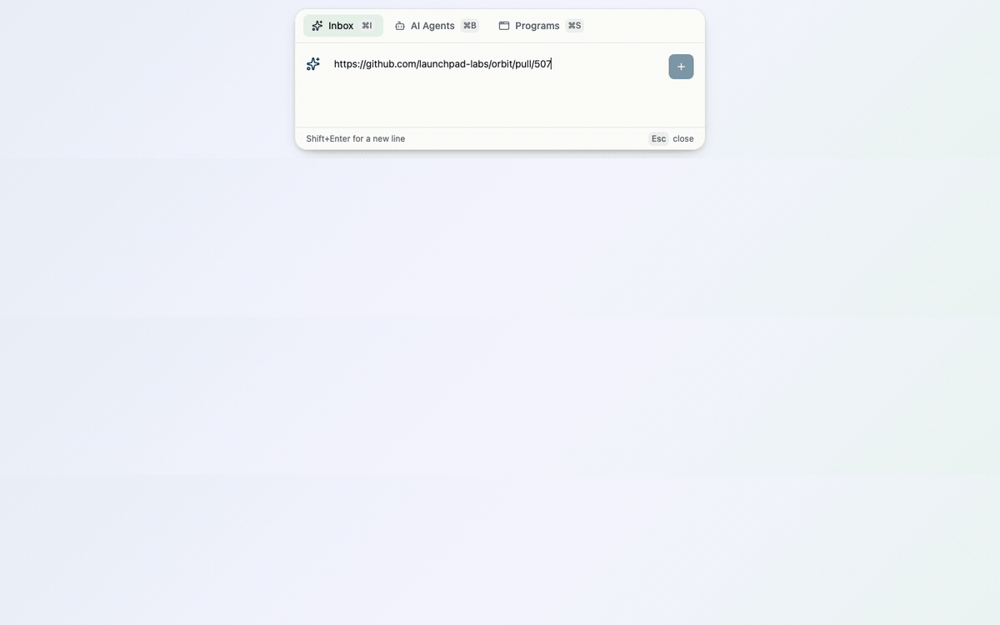

# Station by DevCrashFlash

Station is a local-first desktop workspace for turning scattered developer work into focused, actionable projects. Capture ideas and links, route work to the right project, review pull requests, launch AI-assisted commands, and reconstruct your day without waiting for remote services to load.



## What Station brings together

- **Capture work from anywhere.** Save a thought, file, Trello card, GitHub pull request, or GitLab merge request to the Smart Inbox and route it when you are ready.
- **Keep project context close.** Group tasks with repositories, boards, local checkouts, related work, and external conversation history.
- **Review and delegate.** Open pull-request reviews inside Station or hand a task to reusable Codex and Claude prompts.
- **See the shape of your day.** Combine calendar events with GitHub, GitLab, and Trello activity in a searchable timeline and Markdown summary.
- **Stay productive offline.** Projects, tasks, resources, and most organization workflows load from the local database first.

## From capture to action

Promote a GitHub pull request from the Smart Inbox, choose its project, and continue with the full task context:



## License and time evaluation

Station is **source available**, not open source. It is licensed under the
[Business Source License 1.1](LICENSE). The license grants one time period of
ordinary production use for evaluation. After that period, continued production
use requires a paid [commercial license](COMMERCIAL_LICENSE.md); payment is not
optional even if the application remains functional or displays only a reminder.

Each released version automatically becomes available under the Apache License
2.0 four years after that version's first public distribution. Third-party
components remain under their own terms, listed in
[THIRD_PARTY_NOTICES.md](THIRD_PARTY_NOTICES.md).

Code contributions require acceptance of the
[Contributor License Agreement](CONTRIBUTOR_LICENSE_AGREEMENT.md). See
[CONTRIBUTING.md](CONTRIBUTING.md) before opening a pull request.

## Development

- Install dependencies with `pnpm install`.
- Start the frontend with `pnpm dev`.
- Start the desktop app with `pnpm tauri dev`.

### README demo captures

The README media uses synthetic data and never needs a real Station database or provider credentials. Start the frontend, then open [`http://127.0.0.1:1420/?demo=readme`](http://127.0.0.1:1420/?demo=readme). The development-only query parameter replaces browser storage with the deterministic capture fixture on each refresh; normal development URLs and production builds are unaffected.

With the development server running, regenerate both assets with:

```sh
pnpm capture:readme
```

The capture script uses a 1440×900 light-theme viewport, writes the overview PNG at that resolution, and produces an optimized 1200×750, 10 fps workflow GIF. Set `CHROME_PATH` when Chrome is not installed in a standard location, or `STATION_DEMO_URL` when the development server uses another URL.

### Google Calendar sign-in

The published desktop Google OAuth client is compiled into the app, so Google sign-in
works without local or build configuration. The Google Calendar API must remain enabled
and the OAuth app must remain available to the intended audience in its Google Cloud
project.

The desktop OAuth flow uses PKCE and a temporary loopback callback. Its installed-app
OAuth client ID and client secret are compiled into the app and must not be treated as
confidential. User calendar credentials are stored unencrypted in the local application
database; anyone with access to that database may be able to read them.

## Release

- Run `pnpm release` to increase the patch version and build an installable local macOS DMG.
- Run `pnpm release 0.1.1` (or `pnpm release -- 0.1.1`) to set an explicit version.
- Find the finished `Station_<version>_<architecture>.dmg` installer in
  `src-tauri/target/release/bundle/dmg/`. Version dots are replaced with
  underscores, so an Apple Silicon build of version `0.6.0` produces
  `Station_0_6_0_aarch64.dmg`.

The release command synchronizes the versions in `package.json`, the Tauri config,
and the Rust package files before building. DMG releases must be built on macOS.
The local DMG build deliberately skips updater artifacts; public updater artifacts
are always built from a committed version by GitHub Actions.

Public releases are created only from bare stable version tags such as `0.10.12`:

1. Run `pnpm release <version>`, review and commit the synchronized version files.
2. Push the commit, create a tag matching the configured version exactly, and push
   that tag.
3. GitHub Actions creates a draft release, builds Intel and Apple Silicon DMGs and
   signed updater archives, validates `latest.json`, and publishes the release only
   when both architectures are complete.

The release workflow requires a repository secret named
`TAURI_SIGNING_PRIVATE_KEY`. Its matching public key is compiled into the app.
`TAURI_SIGNING_PRIVATE_KEY_PASSWORD` is optional when the key is not encrypted.
Back up the private key securely: losing it prevents installed versions from
accepting future updates. macOS bundles currently use ad-hoc signing, so users may
need to approve Station in Privacy & Security after the initial manual install.
Versions up to `0.10.11` do not contain the updater and require that one manual
bootstrap installation.

The application bundle includes the BSL, commercial license, and third-party
notices under its `legal` resources directory.

## Local-First Behavior

The app should always prefer local data first. Opening projects, tasks, and
resources must render from the local database without waiting for GitHub,
GitLab, Trello, or any other external network request.

Offline use should work for most read and organization workflows. Network
access is only required for actions that explicitly sync external metadata or
edit/modify external systems, plus a lightweight non-blocking update check at
startup and every six hours. Failed automatic update checks remain silent.
Provider sync may start automatically after local data has rendered when it runs
as bounded background work. Foreground syncs should show status while they run,
and no sync may block local navigation or local editing.

## Frontend Structure

The frontend is organized by component responsibility:

```text
src/
  app/                  # App orchestration and shell layout
  components/
    ui/                 # shadcn-generated or shadcn-style primitives
    common/             # reusable app-level compositions
  views/                # screen-level composition
  features/             # domain-specific UI and behavior
  lib/                  # API clients, parsers, and pure utilities
```

Prefer shadcn primitives before creating custom UI. For example, use
`components/ui/breadcrumb.jsx` for generic breadcrumb primitives, then compose
project/task-specific breadcrumb behavior in `features/navigation`. Use
`<Button size="icon">` for icon-only buttons instead of introducing a custom
`IconButton` wrapper unless the app needs additional shared behavior.

Keep domain-aware components out of `components/ui` and `components/common`.
If a component knows about projects, tasks, resources, pull requests, or
connections, it belongs in `features/*` or a screen-level `views/*` module.
